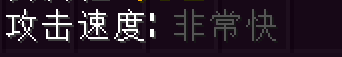

关于属性，相较于 Void 之前的细分的多种元素伤害词条，Sheriruth精简了所有伤害词条，统一为了

攻击力 （你不再需要刷取 xx元素伤害 这种词条了）

取而代之的是，在完成 Chapter I 进入 区域2 之后，每把武器都会拥有独立的属性词条

现有6种不同的属性 物理 / 雷霆 / 火焰 / 冰冻 / 暗影 / 光芒

同时也出现了对应的属性加成

如果你的武器属性是 火焰 那么你造成的伤害只会应用 火焰加成 这一属性，其他属性的加成将会无效

 ---

防御力：你受到的伤害会根据你的防御力来进行调整

  

  （最高可以减少50%的伤害）

物理抗性：每1000点减免约6%的物理伤害，上限60%

元素抗性：每1000点减免约5%的物理伤害，上限50%

（物理/元素抗性的数值在未来会随着更新进度进行调整）

物理精通：每1000点将会提供约5%的物理提升

元素精通：每1000点将会提供约3%的元素提升（对所有元素生效）

（物理/元素精通的数值在未来会随着更新进度进行调整）

会心率：所有攻击命中有多少几率造成会心伤害

    

  （期望的会心伤害）

精准：所有怪物都有自己的闪避几率，一般等级越高，初始的闪避几率就会越高，这条属性可以提高你所有攻击的命中率，如果未命中，那么此次伤害就会强制变为0

闪避率：你有多少几率可以完全免疫此次攻击（闪避成功后不会有任何无敌效果）

攻击速度：每1点攻击速度会将你武器的攻击速度提升一个层次

    一共有5个层次的攻击速度：非常快/快/普通/慢/非常慢
    加入你的武器攻击速度为 “非常慢” 同时你拥有1点攻击速度
    那么你的攻击速度就会提升为 慢
    最快不会快过 非常快 最慢不会慢过 非常慢
    如果你的武器初始攻击速度就是 “非常快” 那么该词条将不会有任何作用
    除非你的值是负数，同理作用于 “非常慢”